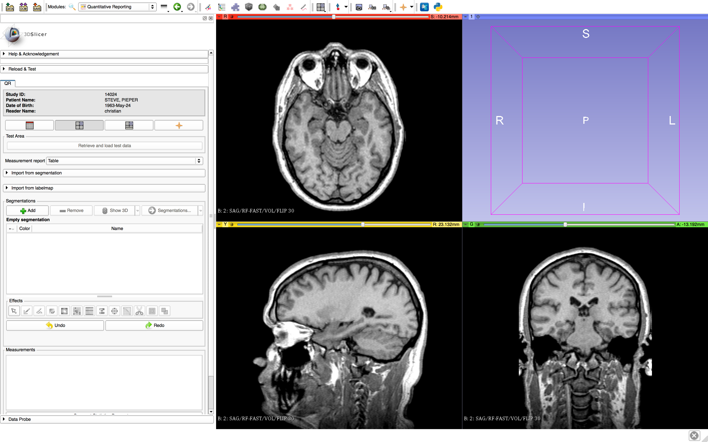
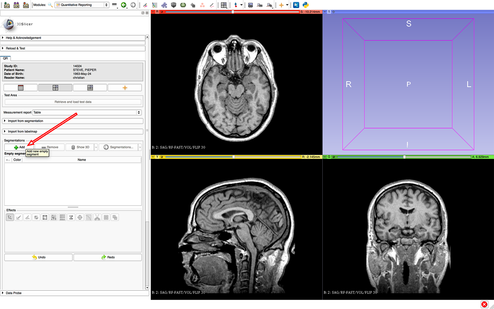
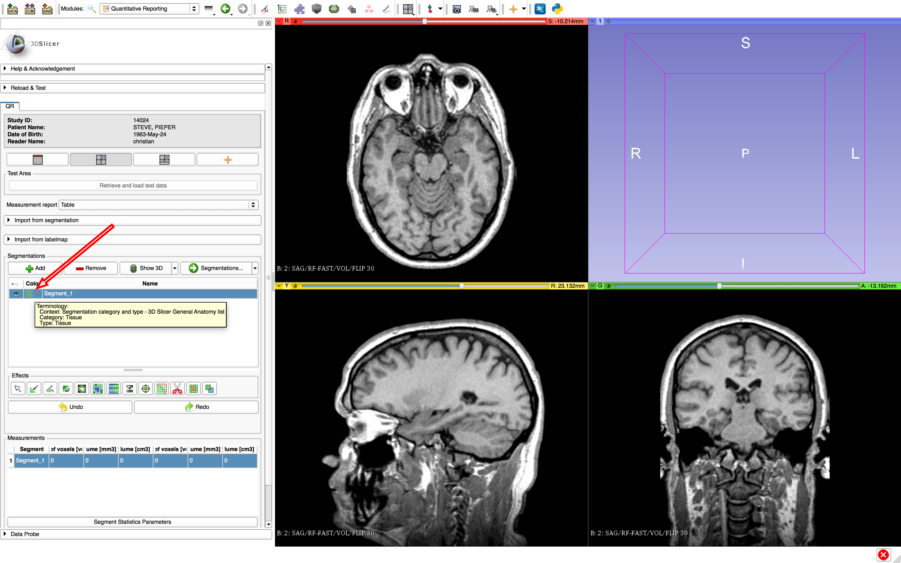
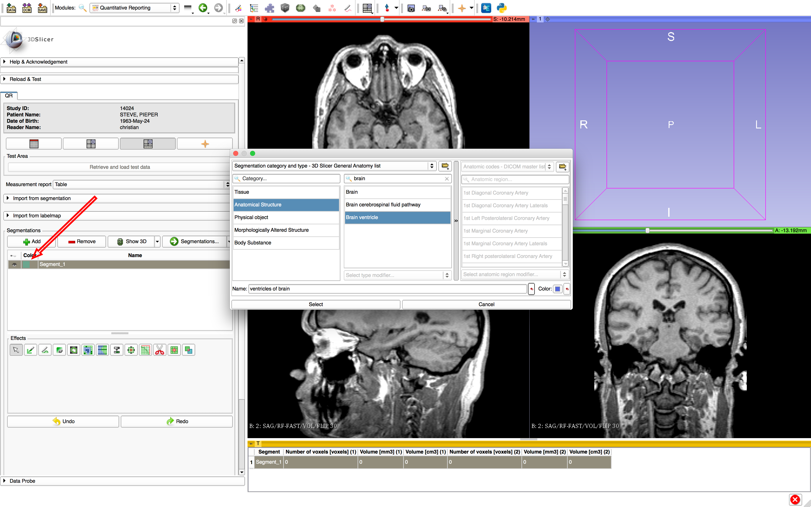
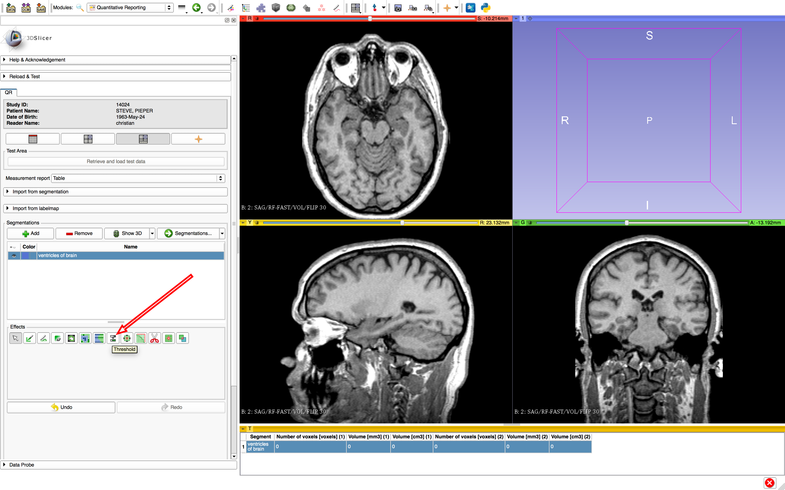
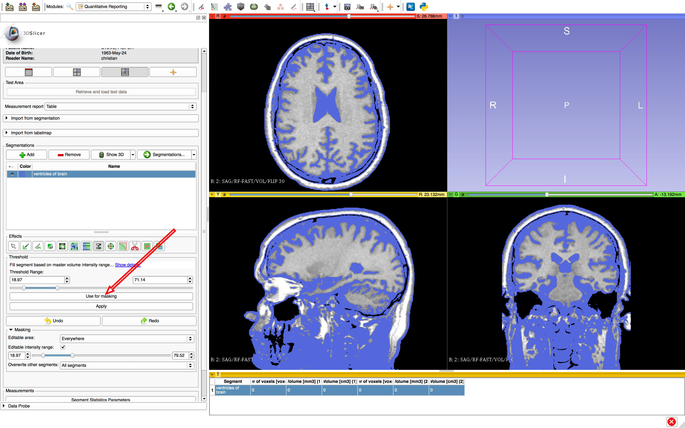
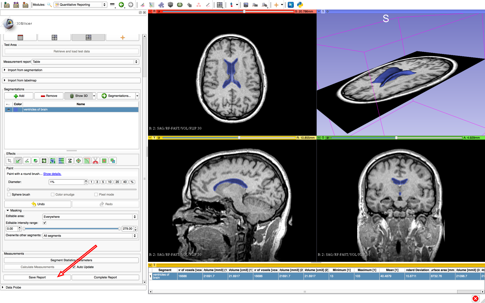

# Tutorial

This section describes in detail how to create a segmentation for a given DICOM sample dataset and save it in combination with automatically created volumetric measurements into the DICOM file format. The resulting data will be stored in the Slicer DICOM database and is therefore centrally accessible for later reading on this computer.

### Prerequisites

Make sure that you followed the instructions given in [Installation and upgrade](install.md)

## Create a DICOM Structured Report

In this section you will learn how to create a DICOM Structured Report which will include a DICOM Segmentation and volumetric measurements.

### Load DICOM Sample Dataset

First of all you will need to download a DICOM sample dataset. 

By using the button shown above the following tasks will be accomplished for you: 

1. **Download** the DICOM sample dataset
2. **Unpacking** and **importing** it into 3D Slicer 
3. Initiating the **creation of a new measurement** table which references the downloaded DICOM sample dataset 
4. **Display** the DICOM sample dataset in your current slice view layout

### Create a Segmentation

In this section we will be segmenting ventricles of the human brain.

#### Add Segment(s)

Once the DICOM sample dataset (or whichever dataset you would like to load into 3D Slicer) has been loaded into `QuantitativeReporting` you can create a first segment. 

By hovering over the segments color icon a tooltip will appear which gives you more information about the terminology which is currently assigned to this segment. 

**Note**: Initially each segment gets the terminology category and type **"Tissue"** assigned .

#### Select Terminology

In order to make a segmentation more specific you can select another terminology by double clicking onto the color icon of the segment. This is shown in the previously displayed picture. The following screenshot shows the terminology selection widget. Select for category "Anatomical Structure" and after that type "Brain" into the search mask of the "Property type". Choose "Brain ventricle" from the proposed list.

#### Segment by Using `SegmentEditor` Effects

In order to make segmentation easier for you, you can select the `Threshold Effect` as displayed below.

The `Threshold Effect` can be used for specifying a range of valid grayscale values that can be used for painting. After you are done selecting the right range for your needs you can select the button "Use For Paint" and it will automatically switch to the `Paint Effect`. 

Now go ahead and paint the along the ventricle of the brain. You will notice, that the thresholded paint will help you a lot going through the slices.

### Save Report
Once you are done with creating a segmentation and you want to save the measurements result as DICOM push one the button "Save Report":

**"Save Report"**: Will create the **partially completed** DICOM Structured Report which could be continued at a later time (work in progress)

**"Complete Report"**: Will create the **completed** DICOM Structured Report representing the final version which usually wouldn't be modified afterwards.

## Load a DICOM Structured Report

This section will show you how to load a DICOM Structured Report from the Slicer DICOM database and how to load and display the results with `Quantitative Reporting`.

1. Open Slicer DICOM browser
2. Select the structured report that you want to load (modality:**SR**)
3. Select "Load" for loading the structured report into Slicer
4. Switch to module `QuantitativeReporting`
5. Select measurement report from dropdown: In case that you freshly restarted Slicer, you will just need to select the only available table from there. Otherwise select the last one.

With completing the previously shown steps, `QuantitativeReporting` should be ready to display the results.  

## Import and Load a Custom DICOM Dataset into 3D Slicer

In case that you want to use your own dataset for running this tutorial, you will need to manually import it into 3D Slicer, load it and create a new measurement report in `QuantitativeReporting`. Once the DICOM dataset has been imported to 3D Slicer the other steps won't take much time.

**add screenshot here** of importing into Slicer

