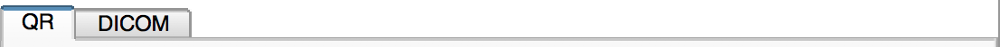
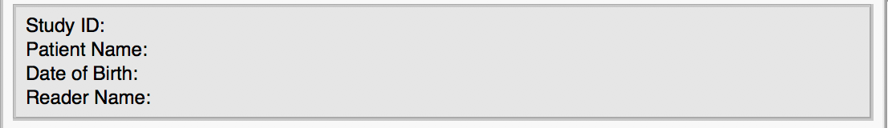
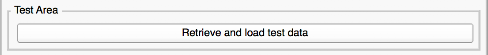
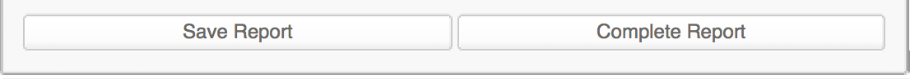

# User Interface Description

## 3D Slicer Interface Overview

The screenshot below shown gives you a basic overview of the 3D Slicer UI components. For further information see [Slicer Documentation](https://www.slicer.org/wiki/Documentation/Nightly/SlicerApplication/MainApplicationGUI)

## `QuantitativeReporting` Interface Overview

The following section describes all `QuantitativeReporting` user interface components from top to bottom.

### Tabs

**QR** tab: This tab contains the **workspace** which will be used in 90% of your workflow

**DICOM** tab: This tab contains the Slicer **DICOM Browser** to make it easier to access within the `QuantitativeReporting` extension \(particularly for the [Slicelet version](slicelet.md)\)

### Information Display

This UI component is used for displaying general information about the currently selected master volume, which is used for creating segmentations and measurements. Furthermore the reader name is displayed. The reader name is populated from your system settings, and will be stored in the DICOM objects you create to identify the creator of the object.

### View Settings Area

We added all currently supported Slicer viewer layouts and in addition to that a button for enabling/disabling the crosshair. When enabled, selecting a segment in the list of segments or in the list of measurements will center the crosshair at the currently selected segment overlay in the viewer to simplify navigation.

### Test Area \(only visible in developer mode\)

Currently this area contains only one button for downloading and displaying a DICOM sample dataset that can be used for testing the module.

### Selector Area

**Measurement report**: Create/select a new table for holding all the measurements created with this extension.

### Import Segmentation Area

Segments can be copied/moved between different segmentations with the aid of this widget.

### Import Labelmap Area

Labelmaps can be imported by using this widget. In some cases the labelmap needs to be resampled in order to do so.

### Segmentations Area

This area is designed to help you with creating segmentations. It includes the [3D Slicer SegmentEditor](https://www.slicer.org/wiki/Documentation/Nightly/Modules/SegmentEditor) widget that adds capabilities for the following operations:

* Add/remove segments:  
* Add terminology for each segment  
* Create surface from segmentations  
* Use a variety of tools \(_effects_\) that help you creating a segmentation \(i.e. thresholding, scissors\)

  For further information see [Slicer Segment Editor](https://www.slicer.org/wiki/Documentation/Nightly/Modules/SegmentEditor).

In order to use this widget, a measurement report needs to be created and a master volume which will be used for creation of segmentations/volumetric measurements has to be selected/assigned.

### Measurements Area and Calculation Controls

Once you start creating segmentations by using the SegmentEditor, you will notice default measurements that will be displayed as the result of the SegmentStatistics module for each created segment within this table. You can either click onto a segment in the SegmentEditor table or the measurements table, which will cause all viewers to jump to the centroid of the selected segment \(as long as there is pixel data of the segment available\).

You can choose whether you manually want to trigger the computation of the previously mentioned measurements, or whether it should be triggered automatically whenever there is a change in segment properties \(pixel data, name, terminology\).

### Report Buttons

You can either save a report and continue later \(needs to be implemented\) or complete the current report. Either way a DICOM Structured Report with a referenced DICOM Segmentation will be created and stored into the Slicer DICOM database.

